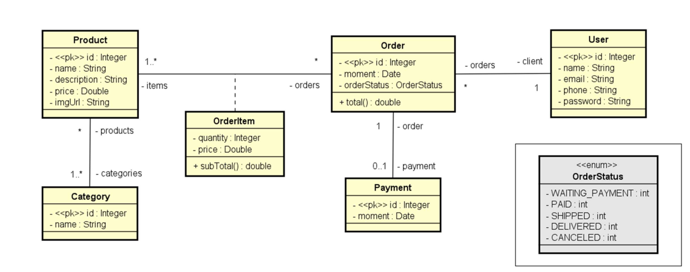
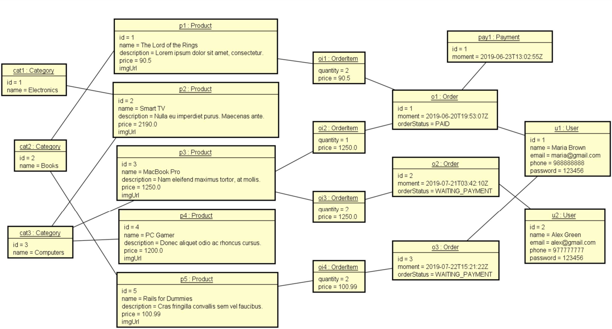
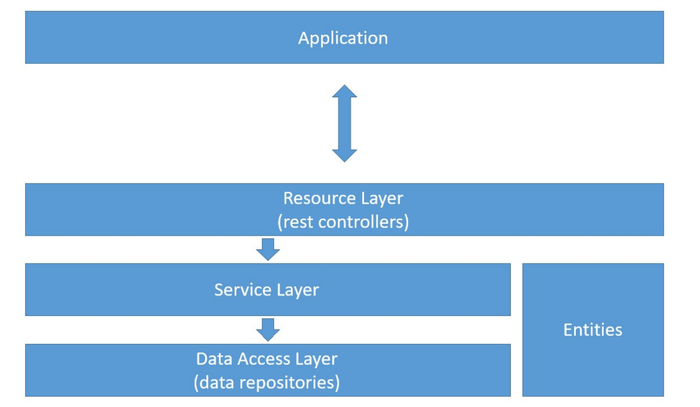
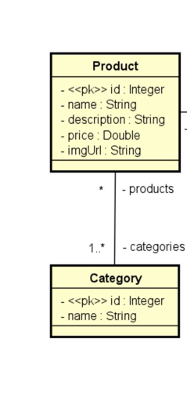
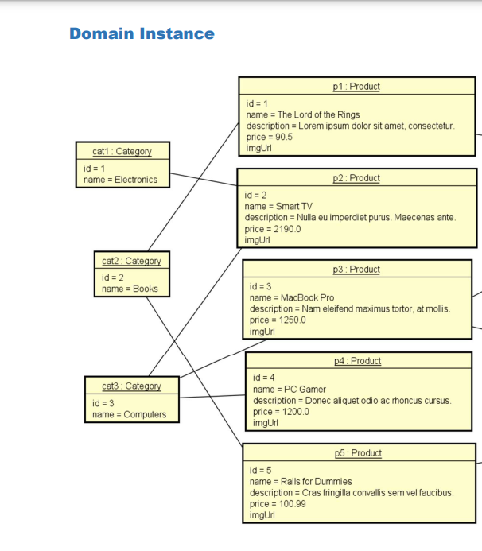

# Projeto Spring Boot - Professor Nelio

## Objetivos:

     Criar projeto Spring Boot Java
     Implementar modelo de domínio
     Estruturar camadas lógicas: resource, service, repository
     Configurar banco de dados de teste (H2)
     Povoar o banco de dados
     CRUD - Create, Retrieve, Update, Delete
     Tratamento de exceções

## Tecnologias

- Spring Boot
- H2
- Maven
- PostgreSQL
- Postman
- JPA

## Domain Model 

## Domain Instance

## Lógica Layers

- Resource que é o controladore REST
- O Controlador depende do Serviço 
- E o serviço depende do Repository

## User entity and resource

Basic entity checklist:

     Basic attributes
     Associations (instantiate collections)
     Constructors
     Getters & Setters (collections: only get)
     hashCode & equals
     Serializable

Observação: 
- como será usado o Framework deve ser incluido o construtor vazio
- o Serializable deve ser inserido quando queremos que os nossos dados sejam transformados em cadeias de bytes
e isso é feito para que o objeto trafegue na rede, para que o objeto seja gravado em arquivo ...

## Inicio do Projeto

Será utilizado o H2 para os testes com Banco.

    -> TESTE para verificar se o Banco H2 está ok
        http://localhost:8080/h2-console

Será criado um profile de test, que é um perfil específico para fazer teste. 
Podem ser criados diversos perfis, como dev com o outro banco, produção quando o perfil está implantado
no cliente que vai utilizat o sistema

Checklist:

         JPA & H2 dependencies
         application.properties
         application-test.properties
         Entity: JPA mapping

Dependencies:

        <dependency>
                <groupId>org.springframework.boot</groupId>
                <artifactId>spring-boot-starter-data-jpa</artifactId>
        </dependency>
        <dependency>
                <groupId>com.h2database</groupId>
                <artifactId>h2</artifactId>
                <scope>runtime</scope>
        </dependency>

application.properties:

        spring.profiles.active=test
        spring.jpa.open-in-view=true

application-test.properties:

        spring.datasource.url=jdbc:h2:mem:testdb
        spring.datasource.username=sa
        spring.datasource.password=
        spring.h2.console.enabled=true
        spring.h2.console.path=/h2-console
        spring.jpa.show-sql=true
        spring.jpa.properties.hibernate.format_sql=true 

## JPA repository, dependency injection, database seeding

* database seeding: inserir automaticamente alguns dados no BD. 

Checklist:

         UserRepository extends JPARepository<User, Long>
         Configuration class for "test" profile
         @Autowired UserRepository
         Instantiate objects in memory
         Persist objects

Objects:

    User u1 = new User(null, "Maria Brown", "maria@gmail.com", "988888888", "123456");
    User u2 = new User(null, "Alex Green", "alex@gmail.com", "977777777", "123456");

Observação exemplo: O UserRepository vai ser o repository que será responsável por fazer
operações com a Entidade User. Será uma interface que estend JpaRepository<User, Long>

Classe de configuração não será nem controller, nem service, e nem repositorie ela será uma
classe auxiliar que vai fazer algumas configurações na aplicação, será salvo no package config.
Ela será anotada com @Configuration e @Profile("test) , dessa maneira ela sabe que você rodará
essa classe apenas como perfil de test o qual definimos no arquivo application.properties.

@Configuration
@Profile("test)
public class TestConfig {

}

Essa classe de configuração será usada a principio para fazer o database seeding ou seja popular o
nosso BD com alguns objetos

## Service layer, component registration

Order, Instant, ISO 8601
Basic new entity checklist:

     Entity
          "To many" association, lazy loading, JsonIgnore
     Repository
     Seed
     Service
     Resource

Objects:
    
    Order o1 = new Order(null, Instant.parse("2019-06-20T19:53:07Z"), u1);
    Order o2 = new Order(null, Instant.parse("2019-07-21T03:42:10Z"), u2);
    Order o3 = new Order(null, Instant.parse("2019-07-22T15:21:22Z"), u1);

Camada de Serviço, a nossa arquitetura básica tem essa divisão de camadas lógicas:

é o controlador que depende de serviços, que por sua vez dependente de repositories

application<->Resource Layer(rest controllers)<->Service Layer<->data repositories

Porque fazemos a camada de serviçoe não fazemos o controlador acessar diretamente o repositorie?
Não é uma regra, mas uma preferencia, criar uma camada intermediária para implementar regras de 
negócios/lógica/orquestração dentro de service. Essa camada Service é feita para separar as responsabilidades
e impedir que o controller fique muito carregado de informação, ou seja que o controlador faça 
exclusivamente o meio de campo entre as iterações do usuário na aplicação e as regras de negócio.
A ideia é construir um controlador enxuto e as regras de negócio vem para a camada de serviço.

Mas dessa forma existem algumas desvantagens por que existirão algumas operações  em que a camada de serviço vai 
simplismente repassar para o repositorie a chamada de alguma coisa.

Por exemplo:

Eu vou fazer um endpoint no controller para recuperar um usuario por id, na camada de serviço não haverá nada especial
eu simplismente vou repassar a chamada para o repositorie.

Para manter a estrutura de Camadas (Layers) sempre faremos o controllador depender sempre de serviço e o serviço
por sua vez vai depender de Repositorie.

- component registration: é por que quando temos um objeto que vai poder ser injetado pelo o mecanismo de injeção de dependencia
do Spring a classe do seu objeto ela tem que estar registrada no mecanismo de injeção de dependencia. Exemplo: @Service

## Classe Order(Pedido), Instant(Para representar um instante), ISO 8601( padrão para representar datas na forma de texto)

Basic new entity checklist:

     Entity
             o "To many" association, lazy loading, JsonIgnore
     Repository
     Seed
     Service
     Resource

Objects:

    Order o1 = new Order(null, Instant.parse("2019-06-20T19:53:07Z"), u1);
    Order o2 = new Order(null, Instant.parse("2019-07-21T03:42:10Z"), u2);
    Order o3 = new Order(null, Instant.parse("2019-07-22T15:21:22Z"), u1);

- "To many" association, lazy loading, JsonIgnore

- lazy loading-> o JPA não carrega os objetos para muitos, para não estourar memória e o tráfego do computador

Utilizando o ResponseEntity
Em situações que precisamos ter mais controle sobre a resposta HTTP em um endpoint, o próprio Spring nos oferece a classe 
ResponseEntity que nos permite manipular os dados HTTP da resposta.

No arquivo application.properties fizemoa a configuração ->  spring.jpa.open-in-view=true
      
    open-in-view=true  -> permite que o Jackson na hora serializar o json permite que ele traga do BD os pedidos
    por isso que no Postman tivemos esse resultado:

    
    "id": 1,
    "name": "Maria Brown",
    "email": "maria@gmail.com",
    "phone": "988888888",
    "password": "123456",
    "orders": [
        {
            "id": 1,
            "moment": "2019-06-20T19:53:07Z"
        },
        {
            "id": 3,
            "moment": "2019-07-22T15:21:22Z"
        }
    ]

    se eu trocar para false o mesmo não carrega dá um erro 500

    {
    "timestamp": "2022-11-05T14:26:15.771+00:00",
    "status": 500,
    "error": "Internal Server Error",
    "path": "/users/2"

    Essa configuração com false : spring.jpa.open-in-view=false
    Essa configuração desabilitou  a posibilidade do jackson que está lá no fim do ciclo de vida chamar o JPA para trazer
    os pedidos associados ao cliente.
    false você não permite que um componente no fim do ciclo de vida  na hora de renderizar o json ele chame de novo o BD
    para chmar o restante.

    deixar como true a cofiguração -> spring.jpa.open-in-view=false
    tem suas vantagens e desvantagens, você complica o seu ciclo de vida , pois o jackson que está no fim do ciclo de vida
    vai ser chamado novamente para renderizar os dados no BD.
    
}

## Associação muitos para muitos com JoinTable

Se olharmos para o nosso Domain Model enxergamos um relacionamento muito para muitos

Na instancia de Dominios temos muitas categorias para muitos produtos. EXEMPLO: o produto Smart Tv está associado com eletronicos e 
Computers. Ou seja um produto pode ter mais de uma categoria, e uma categoria pode ter mais de um produto.

No banco de dados relacional não teremos essa associação de instancias e sim uma tabela de associação( quando transformamos um modelo de
analise em um modelo relacional). Então teremos que mapear a nossa classe Produto e categoria para que essa tabela de associação
apareça lá no banco de dados relacional e faremos isso com a JoinTable.

    //mapeamento para transformar essas coleções que tem nas duas classes na tabela de associação que tem no modelo relacional
    @ManyToMany
    @JoinTable(name = "tb_product_category",// tb_product_category-tabela de associação, com a anotação @JoinTable eu vou falar qual o nome da tabela, e quais vão ser as chaves estrangeiras que vai associar a tabela de produto com a Categoria
            joinColumns =@JoinColumn(name = "product_id"), // joinColumns -> na tabela de product vai ter uma chave estrangeira chamada product_id(essa é a chave estrangeira de product
             inverseJoinColumns = @JoinColumn(name = "category_id"))//defini a chave estrangeira da outra entidade nesse caso Category.
    private Set<Category> categories = new HashSet<>();

    @JsonIgnore//inclui o jsonIgnorar para evitar o looping infinito.
    @ManyToMany(mappedBy = "categories")
    private Set<Product> products = new HashSet<>();

## Mecanismo de banco de dados H2

H2 é um banco de dados relacional escrito em Java. Ele pode ser integrado em aplicativos Java ou executado no 
modo cliente-servidor.

Todos os modos contam com suporte para bancos de dados persistentes e na memória. Não há limite para o 
número de bancos de dados abertos simultaneamente ou para o número de conexões abertas.

- Características H2

  Muito rápido, código aberto, API JDBC
  Modos incorporados e de servidor; bancos de dados na memória
  Aplicativo de console baseado em navegador
  Tamanho pequeno: cerca de 2,5 MB de tamanho de arquivo jar

##  JPA - Jakarta Persistence

Jakarta Persistence ( JPA ; anteriormente Java Persistence API) é uma especificação de interface de programação de 
aplicativos Jakarta EE que descreve o gerenciamento de dados relacionais em aplicativos Java corporativos .

JPA é um framework leve, baseado em POJOS (Plain Old Java Objects) para persistir objetos Java. 
A Java Persistence API, diferente do que muitos imaginam, não é apenas um framework para Mapeamento 
Objeto-Relacional (ORM - Object-Relational Mapping), ela também oferece diversas funcionalidades 
essenciais em qualquer aplicação corporativa.

Atualmente temos que praticamente todas as aplicações de grande porte utilizam JPA para persistir 
objetos Java.

Ferramenta Objeto relacional padrão do Java, essa ferramenta faz uma conversão entre o modelo OO que você
desenvolve em java e o paradigma relacional que é o do Banco de Dados Relacional. E ela faz automaticamente.

- POJOS Persistentes: Talvez o aspecto mais importante da JPA seja o fato que os objetos são POJOs (Plain Old Java Object 
ou Velho e Simples Objeto Java), significando que os objetos possuem design simples que não dependem da herança de 
interfaces ou classes de frameworks externos. Qualquer objeto com um construtor default pode ser feito persistente 
sem nenhuma alteração numa linha de código. Mapeamento Objeto-Relacional com JPA é inteiramente dirigido a metadados. 
Isto pode ser feito através de anotações no código ou através de um XML definido externamente.

## Spring Data JPA 

O Spring Data JPA é uma implementação da abstração de repositório que é um bloco de construção chave do design orientado
a domínio baseado na estrutura de aplicativo Java Spring . Ele suporta de forma transparente todas as implementações de 
JPA disponíveis e suporta operações CRUD , bem como a execução conveniente de consultas de banco de dados.

## Jackson

Jackson é uma excelente biblioteca para lidar com a transformação de texto em código. Ela suporta não só JSON, mas também 
YAML, XML entre outros formatos.

Jackson é uma biblioteca JAVA popular e muito eficiente usada para mapear ou serializar objetos JAVA para JSON e vice-versa.

ObjectMapper é uma classe da biblioteca Jackson. Ela pode transformar classes POJO (Plain Old Java Objects) em JSON 
(JavaScript Object Notation) e vice-versa.

Por ser mais leve que seu antecessor, o XML, e nativo em linguagem populares como o JavaScript, JSON se tornou o formato 
de dado mais utilizado na comunicação de aplicações hoje em dia, especialmente entre APIs RESTful e clientes web/mobile.

Geralmente, será um framework quem utilizará a classe ObjectMapper. Por isso, na maioria das vezes precisaremos apenas 
fazer um de-para do JSON para uma classe Java e vice-versa.

Quanto a classe Java que será escrita, ela deve cumprir certos pré-requisitos, listados abaixo, para que a transformação 
não falhe.

    - Declarar um campo para cada propriedades do JSON;
    - Usar a anotação @JsonIgnoreProperties ou @JsonIgnore para as propriedades que não desejamos utilizar;
    - Declarar métodos assessores (getters) públicos;
    - Garantir que pelo menos um construtor sem argumentos estará presente.

## Como transformar JSON em objetos Java

Esse é um cenário de leitura, também chamado de unmarshal/deserialização, onde recebemos um JSON e desejamos ler/transformar 
ele em uma classe Java.

Por exemplo, para o JSON do Código 3.

    {
    "nome":"Maria da Silva"
    }

...precisamos de uma classe como a que pode ser vista abaixo:

    package br.com.devmedia;
    
    public class Pessoa {
    private String nome;
    
        public String getNome() {
          return nome;
        }
    
        public void setNome(final String nome) {
          this.nome = nome;
        }
    }

Para futuras pesquisas, a conversão de algo em JSON é frequentemente chamada de marshall, ao contrário de unmarshal. 
A comunidade Java costuma usar os termos Serialization (serialização) e Deserialization (deserialização) 
para as mesmas operações sobre POJOs.

## Referencias

- https://www.h2database.com/html/main.html
- https://gasparbarancelli.com/post/banco-de-dados-h2-com-spring-boot
- https://www.devmedia.com.br/introducao-ao-jackson-objectmapper/43174